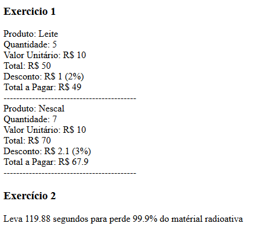

# Teste PRAVALER

## Rodando os Exercicios
- Rode o composer: ``composer install ``
- Subindo um servidor: ``php -S localhost:8081``
- Console: ``php index.php``

## Exercício 1

### Codigo
````php
<?php

namespace App\Exercicio1;

class Produto
{
    public $nome;
    public $quantidade = 0;
    public $valorUnitario = 0;
    public $valorTotal = 0;
    public $porcentagemDesconto = 0;
    public $valorDesconto = 0;
    public $valorTotalAPagar = 0;

    public function __construct($nome, int $quantidade, float $valorunitario)
    {
        $this->nome = $nome;
        $this->quantidade = $quantidade;
        $this->valorUnitario = $valorunitario;
        $this->valorTotal = $this->valorUnitario * $this->quantidade;
        $this->verificaDesconto();
        $this->calculaTotais();
    }

    public function verificaDesconto()
    {
        if ($this->quantidade >= 0 && $this->quantidade <= 5) {
            $this->porcentagemDesconto = 2;
        }

        if ($this->quantidade > 5 && $this->quantidade <= 20) {
            $this->porcentagemDesconto = 3;
        }

        if ($this->quantidade > 10) {
            $this->porcentagemDesconto = 5;
        }
    }

    public function calculaTotais()
    {
        $this->valorDesconto = ($this->valorTotal * $this->porcentagemDesconto) / 100;
        $this->valorTotalAPagar = $this->valorTotal - $this->valorDesconto;
    }
}

````
### Utilização do codigo

````php
use App\Exercicio1\Produto;

$produtos = [];
$produtos[] = new Produto("Leite", 5, 10);
$produtos[] = new Produto("Nescal", 7, 10);
$produtos[] = new Produto("Café", 7, 10);

echo '<h1>Exercicio 1</h1>' . PHP_EOL;
foreach ($produtos as $produto) {
    echo "Nome: {$produto->nome}<br>" . PHP_EOL;
    echo "Quantidade: {$produto->quantidade}<br>" . PHP_EOL;
    echo "Valor: {$produto->valorUnitario}<br>" . PHP_EOL;
    echo "Total: {$produto->valorTotal}<br>" . PHP_EOL;
    echo "Desconto: {$produto->valorDesconto} ({$produto->porcentagemDesconto}%)<br>" . PHP_EOL;
    echo "Total a Pagar: {$produto->valorTotalAPagar}<br>" . PHP_EOL;
    echo "------------------------------------------<br>" . PHP_EOL . PHP_EOL;
}

````

## Exercicio 2

### Codigo

````php
<?php

namespace App\Exercicio2;

class CalculaTempo
{
    public $progresso;
    public $tempoBase;
    public $tempoProgresso = 2;
    public $progressoBase;
    public $progressoPorSegundo = 0;
    public $meta;

    public $tempo = 0;

    public function __construct(int $tempo, float $progressoBase, float $metal)
    {
        $this->meta = $metal;
        $this->tempoBase = $tempo;
        $this->progressoBase = $progressoBase;
        $this->progressoPorSegundo = ($this->progressoBase / $this->tempoBase);
    }

    public function calculaTempo(int $segundos = 1)
    {
        $this->progresso = 100.00;
        $this->tempo = 0;
        while ($this->progresso >= $this->meta) {
            printf("%d segundos = %f%% <br>%s", $this->tempo, $this->progresso, PHP_EOL);
            $this->progresso -= ($this->progressoPorSegundo * $segundos);
            $this->tempo += $segundos;
        }
    }
}
````
### Utilizando o codigo
````php

use App\Exercicio2\CalculaTempo;

$tempo = new CalculaTempo(30, 25, 0.10);
echo '<h1>Exercicio 2</h1>' . PHP_EOL;
$tempo->calculaTempo(15);
echo "Leva {$tempo->tempo} segundos para chegar {$tempo->meta}" . PHP_EOL;

````

## Resultado no browser

