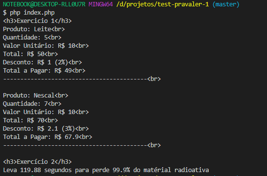

# Teste PRAVALER

## Rodando os Exercicios
- Rode o composer: ``php composer.phar install``
- Subindo um servidor: ``php -S localhost:8081``
- Console: ``php index.php``

## Exercício 1

### Codigo
````php
<?php

namespace App\Exercicio1;

class Produto
{
    public $nome;
    public $quantidade = 0;
    public $valorUnitario = 0;
    public $valorTotal = 0;
    public $porcentagemDesconto = 0;
    public $valorDesconto = 0;
    public $valorTotalAPagar = 0;

    public function __construct($nome, int $quantidade, float $valorunitario)
    {
        $this->nome = $nome;
        $this->quantidade = $quantidade;
        $this->valorUnitario = $valorunitario;
        $this->valorTotal = $this->valorUnitario * $this->quantidade;
        $this->verificaDesconto();
        $this->calculaTotais();
    }

    public function verificaDesconto()
    {
        if ($this->quantidade >= 0 && $this->quantidade <= 5) {
            $this->porcentagemDesconto = 2;
        }

        if ($this->quantidade > 5 && $this->quantidade <= 20) {
            $this->porcentagemDesconto = 3;
        }

        if ($this->quantidade > 10) {
            $this->porcentagemDesconto = 5;
        }
    }

    public function calculaTotais()
    {
        $this->valorDesconto = ($this->valorTotal * $this->porcentagemDesconto) / 100;
        $this->valorTotalAPagar = $this->valorTotal - $this->valorDesconto;
    }
}

````
### Utilização do codigo

````php
use App\Exercicio1\Produto;

$produtos = [];
$produtos[] = new Produto("Leite", 5, 10);
$produtos[] = new Produto("Nescal", 7, 10);
$produtos[] = new Produto("Café", 7, 10);

echo '<h1>Exercicio 1</h1>' . PHP_EOL;
foreach ($produtos as $produto) {
    $produto->print();
}

````

## Exercício 2

### Codigo

````php
<?php


namespace App\Exercicio2;

class Calculadora
{

    /**
     * Regra de três:
     * 10 (A) ---- 100% (B)
     *  ? (X) ---- 80% (C)
     * @return float valor do (X)
     */
    public static function regraDeTres(float $a, float $b, float $c)
    {
        return self::divide(($a * $c), $b);
    }

    /**
     * Divide X por Y
     * @return float
     */
    public static function divide(float $x, float $y)
    {
        if ($y == 0) {
            return 0.0;
        }
        return $x / $y;
    }
}

````
### Utilizando o codigo
````php

use App\Exercicio2\Calculadora;

$tempo = 30.0;
$tempoPorcentagem = 25.0;
$meta = 0.10;

// Quantos porcento anda em 1 segundo
$porcentagemPorSegundo = Calculadora::divide($tempoPorcentagem, $tempo);
// Quantos porcento preciso atingir
$porcentagemMeta = 100 - $meta;
// Quanto tempo em segundos levo para atinger a porcentagem
$segundos = Calculadora::regraDeTres(1, $porcentagemPorSegundo, $porcentagemMeta);

echo "<h3>Exercício 2</h3>" . PHP_EOL;
echo "Leva {$segundos} segundos para perde {$porcentagemMeta}% do matérial radioativa";

````

## Resultado no browser


## Resultado no console/terminal

